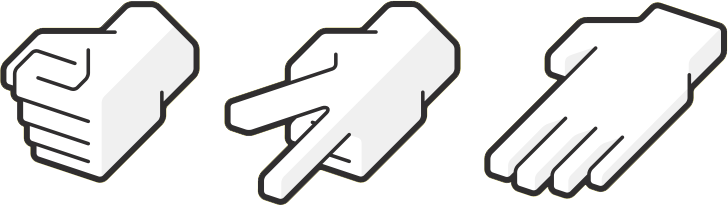

<h3 align="center">
    
    <br><br>
    <b>Take a few minutes and have some fun with this Rock Paper and Scissors game! :)</b>  
    <br>
</h3>

# Index

- [About](#about)
- [Technologies](#technologies)
- [How to use](#how-to-use)

<a id="about"></a>

## :bookmark: About

<strong>Rock Paper and Scissors</strong> is a hand game usually played between two people, in which each player simultaneously forms one of three shapes with an outstretched hand. These shapes are "rock" (a closed fist), "paper" (a flat hand), and "scissors" (a fist with the index finger and middle finger extended, forming a V). "Scissors" is identical to the two-fingered V sign (also indicating "victory" or "peace") except that it is pointed horizontally instead of being held upright in the air. A simultaneous, zero-sum game, it has only two possible outcomes: a draw, or a win for one player and a loss for the other.

This application was made to exercise the basic of <strong>HTML, CSS and JavaScript</strong>.

<a id="technologies"></a>

## :rocket: Technologies

The project is made with:

- [Vanilla JavaScript](https://www.javascript.com/)

## :heavy_check_mark: :computer: Web

<h1 align="center">
    
</h1>


<a id="how-to-use"></a>

## :fire: How to Use:

```sh
  $ git clone https://github.com/dpisati/rock-paper-scissor.git
```
